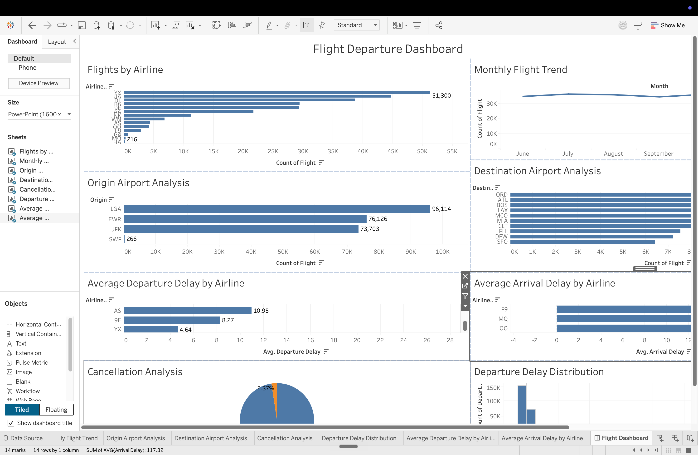

Flight Departure Dashboard
📖 Project Overview

The Flight Departure Dashboard is an interactive data visualization project developed using Python, Streamlit, and Tableau. The project analyzes flight operations from New York airports and provides insights into airline performance, airport traffic, delays, cancellations, and monthly trends.


 Objectives

- Analyze airline performance
- Monitor departure and arrival delays
- Identify busy airports
- Analyze cancellation trends
- Visualize monthly flight activity
- Build interactive dashboards


 📊 Dataset

The dataset contains **246,209 flight records** from New York airports.

Features

- Airline ID
- Flight Number
- Origin Airport
- Destination Airport
- Departure Delay
- Arrival Delay
- Cancellation Status
- Distance
- Air Time
- Month
- Weekday


 🛠️ Technologies Used

- Python
- Pandas
- Streamlit
- Plotly
- Tableau Public
- Git
- GitHub


Exploratory Data Analysis (EDA)

Key insights:

- Total Flights: **246,209**
- Cancelled Flights: **5,835**
- Average Departure Delay: **12.94 minutes**
- Average Arrival Delay: **5.51 minutes**
- LGA is the busiest origin airport.
- ORD is the busiest destination airport.

Streamlit Dashboard Features

- Dashboard Overview
- Airline Analysis
- Airport Analysis
- Delay Analysis
- KPI Cards
- Interactive Filters
- Professional Dashboard Layout


Tableau Dashboard Features

- Flights by Airline
- Monthly Flight Trend
- Origin Airport Analysis
- Destination Airport Analysis
- Cancellation Analysis
- Departure Delay Distribution
- Average Departure Delay
- Average Arrival Delay


Dashboard Screenshots

 Streamlit Dashboard


---

### Tableau Dashboard



---

## 🚀 Installation

Clone the repository

```bash
git clone https://github.com/ShantanuDongare11/FlightDashboardProject.git
```

Move into the project

```bash
cd FlightDashboardProject
```

Install dependencies

```bash
pip install -r requirements.txt
```

Run the Streamlit dashboard

```bash
streamlit run app.py
```

---

## 📂 Project Structure

```
FlightDashboardProject/
│
├── assets/
├── data/
├── images/
├── pages/
├── app.py
├── utils.py
├── config.py
├── requirements.txt
├── README.md
└── .gitignore
```


 Future Improvements

- Real-time flight tracking
- Weather integration
- Predictive delay analysis using Machine Learning
- Airport comparison dashboard

---

 Author

Shantanu Dongare

Master of Science (Data Science)

HAW Kiel, Germany

GitHub: https://github.com/ShantanuDongare11